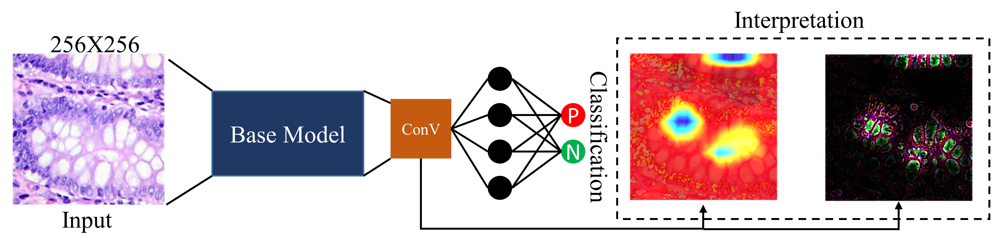

### Publication
1.	Pal, Ratnabali, Samarjit Kar, and Arif Ahmed Sekh. "What and Why? Interpretability in Colon Cancer Detection." In Proceedings of International Conference on Data Science and Applications: ICDSA 2022, Volume 1, pp. 771-780. Singapore: Springer Nature Singapore, 2023.

### Abstract
Colorectal Cancer (CRC) is treated as one of a most frequent cancer, and it is the third leading cancer ended with death. Recent progress in deep neural network makes it possible to detect such cancer automatically and accurately from histopathological images. The main challenges of such neural network based model is that we can not understand why it is making such decision and that leads to a question of trust. Histopathological whole slide images are typically large volume, and manual analysis of such data is tedious. In this paper, we have shown a traditional convolutional neural network (CNN) can be used to answer what (cancer or non-cancer) and attention-based pixel highlighter can highlight the important regions and can be helpful for human expert to validate the decision (why). We have used LC25000 dataset to evaluate the proposed method. The results shown a state-of-the-art accuracy with ability to explain the decision.
### License

Copyright © 2021 Ratnabali Pal

The content of this repository is bound by the following licenses:

- The documents and data are licensed under the MIT license.
